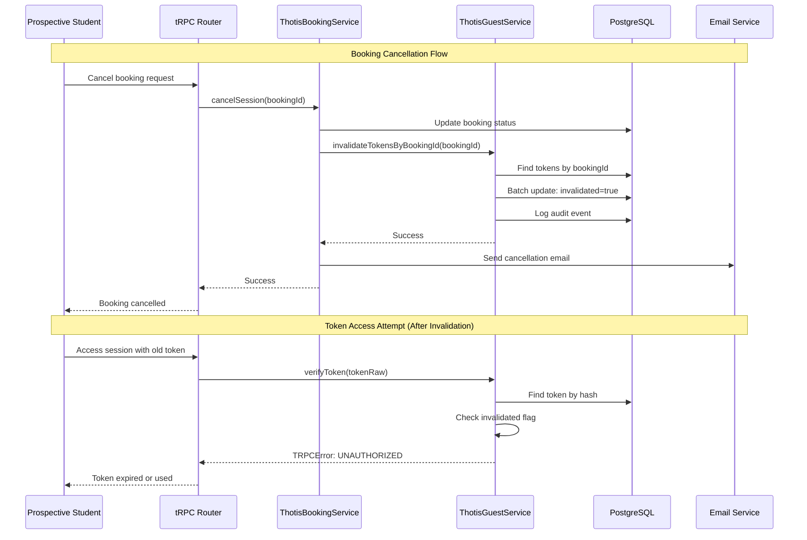

# Design Document: Magic Link Invalidation

## Overview

This design implements automatic invalidation of magic link tokens when booking lifecycle events occur in the Thotis student mentoring platform. The solution enhances security by ensuring that magic links become unusable after critical state changes (cancellation, rescheduling, rating, or incident reporting), preventing unauthorized access to stale or invalid session information.

The design follows Cal.com's architectural patterns:
- Service-based business logic (ThotisGuestService)
- Repository pattern for data access
- Integration with existing booking lifecycle hooks
- Comprehensive error handling with ErrorWithCode
- Audit logging for security compliance

## Architecture

### Component Interaction Flow



### Integration Points

1. **ThotisBookingService**: Existing service methods will call token invalidation
   - `cancelSession()` → invalidate tokens
   - `rescheduleSession()` → invalidate old tokens, generate new token
   - `markSessionComplete()` → no invalidation (allow post-session access)
   - `markSessionAsNoShow()` → invalidate tokens

2. **SessionRatingService**: New integration for rating submissions
   - `createRating()` → invalidate token after successful rating

3. **MentorQualityRepository**: New integration for incident reporting
   - After incident creation → invalidate token

4. **ThotisGuestService**: Enhanced with new methods
   - `invalidateTokensByBookingId()` → batch invalidation
   - `invalidateToken()` → single token invalidation (existing, enhanced)
   - `verifyToken()` → enhanced validation (existing)

## Components and Interfaces

### ThotisGuestService Enhancements

```typescript
export class ThotisGuestService {
  private readonly TOKEN_TTL_MINUTES = 15;

  /**
   * Invalidates all magic link tokens associated with a booking
   * Used during booking lifecycle events (cancel, reschedule, etc.)
   * 
   * @param bookingId - The booking ID whose tokens should be invalidated
   * @param reason - The reason for invalidation (for audit logging)
   * @returns Promise<number> - Number of tokens invalidated
   */
  async invalidateTokensByBookingId(
    bookingId: number,
    reason: 'booking_cancelled' | 'booking_rescheduled' | 'rating_submitted' | 'incident_reported'
  ): Promise<number> {
    // Find all tokens for this booking
    const tokens = await prisma.thotisMagicLinkToken.findMany({
      where: { bookingId },
      select: { id: true, guestId: true, invalidated: true }
    });

    if (tokens.length === 0) {
      return 0;
    }

    // Batch update all tokens
    const now = new Date();
    const result = await prisma.thotisMagicLinkToken.updateMany({
      where: { 
        bookingId,
        invalidated: false // Only update tokens that aren't already invalidated
      },
      data: {
        invalidated: true,
        usedAt: now
      }
    });

    // Log audit events for each unique guest
    const uniqueGuestIds = [...new Set(tokens.map(t => t.guestId))];
    await Promise.all(
      uniqueGuestIds.map(guestId =>
        this.logAccess(
          guestId,
          'invalidateTokensByBookingId',
          'INVALIDATE_TOKEN',
          bookingId.toString(),
          true,
          { reason }
        )
      )
    );

    return result.count;
  }

  /**
   * Generates a new magic link token for a rescheduled booking
   * 
   * @param email - Guest email address
   * @param bookingId - The new/rescheduled booking ID
   * @returns Promise<string> - The raw token (for email sending)
   */
  async generateTokenForRescheduledBooking(
    email: string,
    bookingId: number
  ): Promise<string> {
    const normalizedEmail = email.toLowerCase().trim();

    // Find or create guest identity
    let guest = await prisma.thotisGuestIdentity.findUnique({
      where: { normalizedEmail }
    });

    if (!guest) {
      guest = await prisma.thotisGuestIdentity.create({
        data: { email, normalizedEmail }
      });
    }

    if (guest.blocked) {
      throw new TRPCError({ code: 'FORBIDDEN', message: 'Access denied' });
    }

    // Generate new token
    const tokenRaw = randomBytes(32).toString('hex');
    const tokenHash = createHash('sha256').update(tokenRaw).digest('hex');
    const now = new Date();
    const expiresAt = new Date(now.getTime() + this.TOKEN_TTL_MINUTES * 60 * 1000);

    await prisma.thotisMagicLinkToken.create({
      data: {
        tokenHash,
        guestId: guest.id,
        bookingId,
        expiresAt
      }
    });

    await this.logAccess(
      guest.id,
      'generateTokenForRescheduledBooking',
      'CREATE_TOKEN',
      bookingId.toString(),
      true
    );

    return tokenRaw;
  }

  /**
   * Enhanced token verification with invalidation checks
   * (Existing method - enhanced documentation)
   */
  async verifyToken(tokenRaw: string) {
    const tokenHash = createHash('sha256').update(tokenRaw).digest('hex');

    const magicLink = await prisma.thotisMagicLinkToken.findUnique({
      where: { tokenHash },
      include: { guest: true }
    });

    if (!magicLink) {
      throw new TRPCError({ code: 'UNAUTHORIZED', message: 'Invalid token' });
    }

    // Check all invalidation conditions
    if (magicLink.invalidated || magicLink.usedAt || magicLink.expiresAt < new Date()) {
      throw new TRPCError({ code: 'UNAUTHORIZED', message: 'Token expired or used' });
    }

    return magicLink;
  }

  /**
   * Enhanced audit logging with metadata support
   */
  async logAccess(
    guestId: string | null,
    endpoint: string,
    action: string,
    resourceId: string | null = null,
    success: boolean = true,
    metadata?: Record<string, any>
  ) {
    await prisma.thotisGuestAccessLog.create({
      data: {
        guestId,
        endpoint,
        action,
        resourceId,
        success,
        // Note: metadata field may need to be added to schema if not present
      }
    });
  }
}
```

### ThotisBookingService Integration

```typescript
export class ThotisBookingService {
  private guestService: ThotisGuestService;

  constructor(
    private readonly prisma: Prisma.TransactionClient | PrismaClient,
    analytics?: AnalyticsService,
    redis?: RedisService,
    thotisAnalytics?: ThotisAnalyticsService,
    guestService?: ThotisGuestService
  ) {
    // ... existing initialization
    this.guestService = guestService || new ThotisGuestService();
  }

  /**
   * Enhanced cancelSession with token invalidation
   */
  async cancelSession(
    bookingId: number,
    reason: string,
    cancelledBy: 'mentor' | 'student',
    requester: { id?: number; email?: string }
  ): Promise<void> {
    // ... existing cancellation logic ...

    // Invalidate magic link tokens (non-blocking)
    try {
      const invalidatedCount = await this.guestService.invalidateTokensByBookingId(
        bookingId,
        'booking_cancelled'
      );
      console.log(`[ThotisBookingService] Invalidated ${invalidatedCount} tokens for booking ${bookingId}`);
    } catch (error) {
      // Log but don't block cancellation
      console.error('[ThotisBookingService] Failed to invalidate tokens during cancellation', error);
    }

    // ... rest of existing logic ...
  }

  /**
   * Enhanced rescheduleSession with token invalidation and regeneration
   */
  async rescheduleSession(
    bookingId: number,
    newDateTime: Date,
    requester: { id?: number; email?: string }
  ): Promise<{
    bookingId: number;
    googleMeetLink: string;
    calendarEventId: string;
    confirmationSent: boolean;
  }> {
    // ... existing rescheduling logic ...

    // Get prospective student email from booking responses
    const responses = booking.responses as { email?: string; name?: string } | null;
    const prospectiveStudentEmail = responses?.email;

    // Invalidate old tokens
    try {
      const invalidatedCount = await this.guestService.invalidateTokensByBookingId(
        bookingId,
        'booking_rescheduled'
      );
      console.log(`[ThotisBookingService] Invalidated ${invalidatedCount} old tokens for booking ${bookingId}`);
    } catch (error) {
      console.error('[ThotisBookingService] Failed to invalidate old tokens during rescheduling', error);
    }

    // Generate new token for rescheduled booking
    let newMagicLinkToken: string | null = null;
    if (prospectiveStudentEmail) {
      try {
        newMagicLinkToken = await this.guestService.generateTokenForRescheduledBooking(
          prospectiveStudentEmail,
          bookingId
        );
        console.log(`[ThotisBookingService] Generated new token for rescheduled booking ${bookingId}`);
      } catch (error) {
        console.error('[ThotisBookingService] Failed to generate new token for rescheduled booking', error);
      }
    }

    // Send rescheduling email with new magic link
    if (newMagicLinkToken && prospectiveStudentEmail) {
      try {
        const magicLinkUrl = `${process.env.NEXT_PUBLIC_WEBAPP_URL}/thotis/my-sessions?token=${newMagicLinkToken}`;
        // Email sending logic would include the new magic link
        // ... existing email logic ...
      } catch (error) {
        console.error('[ThotisBookingService] Failed to send rescheduling email with new magic link', error);
      }
    }

    // ... rest of existing logic ...
  }

  /**
   * Enhanced markSessionAsNoShow with token invalidation
   */
  async markSessionAsNoShow(
    bookingId: number,
    requester: { id?: number; email?: string; isSystem?: boolean }
  ): Promise<void> {
    // ... existing no-show logic ...

    // Invalidate magic link tokens (non-blocking)
    try {
      const invalidatedCount = await this.guestService.invalidateTokensByBookingId(
        bookingId,
        'booking_cancelled'
      );
      console.log(`[ThotisBookingService] Invalidated ${invalidatedCount} tokens for no-show booking ${bookingId}`);
    } catch (error) {
      console.error('[ThotisBookingService] Failed to invalidate tokens during no-show', error);
    }

    // ... rest of existing logic ...
  }
}
```

### SessionRatingService Integration

```typescript
export class SessionRatingService {
  private guestService: ThotisGuestService;

  constructor(
    private readonly repository: SessionRatingRepository,
    analytics?: AnalyticsService,
    guestService?: ThotisGuestService
  ) {
    this.analytics = analytics || new AnalyticsService();
    this.guestService = guestService || new ThotisGuestService();
  }

  /**
   * Enhanced createRating with token invalidation
   */
  async createRating(data: {
    bookingId: number;
    studentProfileId: string;
    rating: number;
    feedback?: string | null;
  }): Promise<{
    id: string;
    bookingId: number;
    studentProfileId: string;
    rating: number;
    feedback: string | null;
    createdAt: Date;
  }> {
    // ... existing validation and rating creation logic ...

    const rating = await this.repository.createRating({
      bookingId: data.bookingId,
      studentProfileId: data.studentProfileId,
      rating: data.rating,
      feedback: data.feedback ?? null
    });

    // Invalidate magic link token after successful rating (non-blocking)
    try {
      const invalidatedCount = await this.guestService.invalidateTokensByBookingId(
        data.bookingId,
        'rating_submitted'
      );
      console.log(`[SessionRatingService] Invalidated ${invalidatedCount} tokens after rating for booking ${data.bookingId}`);
    } catch (error) {
      console.error('[SessionRatingService] Failed to invalidate tokens after rating', error);
    }

    this.analytics.trackRatingSubmitted(rating as any, { metadata: (rating as any).booking?.metadata });

    return {
      ...rating,
      id: rating.id
    } as any;
  }
}
```

### MentorQualityRepository Integration

```typescript
export class MentorQualityRepository {
  private guestService: ThotisGuestService;

  constructor(deps?: { prismaClient?: PrismaClient; guestService?: ThotisGuestService }) {
    this.prismaClient = deps?.prismaClient || prisma;
    this.guestService = deps?.guestService || new ThotisGuestService();
  }

  /**
   * Enhanced createIncident with token invalidation
   */
  async createIncident(data: {
    studentProfileId: string;
    bookingUid: string;
    type: MentorIncidentType;
    description: string;
    reportedByUserId: number | null;
  }) {
    const incident = await this.prismaClient.mentorQualityIncident.create({
      data,
      include: {
        studentProfile: true,
        reportedBy: true
      }
    });

    // Find booking ID from UID for token invalidation
    const booking = await this.prismaClient.booking.findFirst({
      where: { uid: data.bookingUid },
      select: { id: true }
    });

    if (booking) {
      // Invalidate magic link token after incident report (non-blocking)
      try {
        const invalidatedCount = await this.guestService.invalidateTokensByBookingId(
          booking.id,
          'incident_reported'
        );
        console.log(`[MentorQualityRepository] Invalidated ${invalidatedCount} tokens after incident report for booking ${booking.id}`);
      } catch (error) {
        console.error('[MentorQualityRepository] Failed to invalidate tokens after incident report', error);
      }
    }

    return incident;
  }
}
```

## Data Models

### Existing Schema (No Changes Required)

The existing `ThotisMagicLinkToken` model already has all required fields:

```prisma
model ThotisMagicLinkToken {
  id          String              @id @default(cuid())
  tokenHash   String              @unique
  guestId     String
  guest       ThotisGuestIdentity @relation(fields: [guestId], references: [id], onDelete: Cascade)
  expiresAt   DateTime
  usedAt      DateTime?           // Used for invalidation tracking
  invalidated Boolean             @default(false) // Primary invalidation flag

  bookingId Int?                  // Critical for batch invalidation
  booking   Booking? @relation(fields: [bookingId], references: [id], onDelete: Cascade)

  createdAt DateTime @default(now())

  @@index([guestId])
  @@index([tokenHash])
  @@index([bookingId])           // Existing index supports efficient queries
}
```

### Query Patterns

**Batch Invalidation Query:**
```typescript
// Efficient batch update using existing bookingId index
await prisma.thotisMagicLinkToken.updateMany({
  where: { 
    bookingId: bookingId,
    invalidated: false 
  },
  data: {
    invalidated: true,
    usedAt: new Date()
  }
});
```

**Token Verification Query:**
```typescript
// Existing query with enhanced validation
const token = await prisma.thotisMagicLinkToken.findUnique({
  where: { tokenHash },
  select: {
    id: true,
    guestId: true,
    expiresAt: true,
    usedAt: true,
    invalidated: true,
    bookingId: true,
    guest: {
      select: {
        id: true,
        email: true,
        blocked: true
      }
    }
  }
});

// Validation checks
if (!token || token.invalidated || token.usedAt || token.expiresAt < new Date()) {
  throw new TRPCError({ code: 'UNAUTHORIZED', message: 'Token expired or used' });
}
```

## Correctness Properties

*A property is a characteristic or behavior that should hold true across all valid executions of a system—essentially, a formal statement about what the system should do. Properties serve as the bridge between human-readable specifications and machine-verifiable correctness guarantees.*


### Property 1: Booking Lifecycle Events Invalidate Tokens

*For any* booking that undergoes a lifecycle event (cancellation by mentor, cancellation by student, no-show, rescheduling, rating submission, or incident reporting), all magic link tokens associated with that booking should be marked as invalidated.

**Validates: Requirements 1.1, 1.2, 1.3, 2.1, 3.1, 4.1, 6.3**

### Property 2: Token Invalidation Data Integrity

*For any* token that is invalidated, the system should set both the `invalidated` field to true and the `usedAt` field to a non-null timestamp representing the invalidation time.

**Validates: Requirements 1.4, 5.3**

### Property 3: Invalid Token Rejection

*For any* token where `invalidated` is true, OR `usedAt` is not null, OR `expiresAt` is less than the current time, the token verification process should throw an unauthorized error with the message "Token expired or used".

**Validates: Requirements 1.5, 2.4, 3.2, 3.3, 4.2, 4.3, 6.5, 7.1, 7.2, 7.3, 7.4**

### Property 4: Valid Token Acceptance

*For any* token where `invalidated` is false, AND `usedAt` is null, AND `expiresAt` is greater than the current time, the token verification process should successfully return the token and associated guest information.

**Validates: Requirements 7.5**

### Property 5: Batch Token Invalidation

*For any* booking ID with associated tokens, calling `invalidateTokensByBookingId` should result in all tokens for that booking having `invalidated` set to true and `usedAt` set to a timestamp.

**Validates: Requirements 5.2, 5.3**

### Property 6: Rescheduling Token Regeneration

*For any* booking that is rescheduled, the system should invalidate all existing tokens for that booking AND generate exactly one new token with the same TTL (15 minutes) for the rescheduled booking.

**Validates: Requirements 2.2, 2.5, 6.4**

### Property 7: Token TTL Invariant

*For all* tokens created by the system (initial booking, rescheduled booking, or any other creation path), the time-to-live should be exactly 15 minutes from the creation timestamp.

**Validates: Requirements 2.5, 6.4**

### Property 8: Audit Log Creation

*For any* token invalidation operation, the system should create an audit log entry in ThotisGuestAccessLog containing the guest ID, action type "INVALIDATE_TOKEN", booking ID as resource ID, success status, and the invalidation reason.

**Validates: Requirements 5.5, 8.1, 8.2, 8.3, 8.4, 8.5**

### Property 9: Empty Booking Invalidation Idempotence

*For any* booking ID that has no associated tokens, calling `invalidateTokensByBookingId` should complete successfully and return a count of 0 without throwing errors.

**Validates: Requirements 5.4, 9.3**

## Error Handling

### Error Handling Strategy

The design follows a **non-blocking error handling** approach for token invalidation:

1. **Primary Operations First**: Booking lifecycle operations (cancel, reschedule, etc.) complete their core functionality before attempting token invalidation
2. **Try-Catch Isolation**: Token invalidation is wrapped in try-catch blocks to prevent failures from blocking booking operations
3. **Comprehensive Logging**: All errors are logged with context for debugging and monitoring
4. **Graceful Degradation**: If token invalidation fails, the booking operation succeeds, but security is slightly degraded (tokens remain valid until expiry)

### Error Scenarios

**Database Connection Failures:**
```typescript
try {
  await guestService.invalidateTokensByBookingId(bookingId, 'booking_cancelled');
} catch (error) {
  console.error('[ThotisBookingService] Failed to invalidate tokens during cancellation', {
    bookingId,
    error: error.message,
    stack: error.stack
  });
  // Continue with booking cancellation - don't throw
}
```

**Non-Existent Booking IDs:**
```typescript
async invalidateTokensByBookingId(bookingId: number, reason: string): Promise<number> {
  const tokens = await prisma.thotisMagicLinkToken.findMany({
    where: { bookingId },
    select: { id: true, guestId: true }
  });

  if (tokens.length === 0) {
    // No tokens to invalidate - this is not an error
    return 0;
  }

  // Proceed with invalidation...
}
```

**Token Verification Errors:**
```typescript
async verifyToken(tokenRaw: string) {
  const tokenHash = createHash('sha256').update(tokenRaw).digest('hex');

  const magicLink = await prisma.thotisMagicLinkToken.findUnique({
    where: { tokenHash },
    include: { guest: true }
  });

  if (!magicLink) {
    throw new TRPCError({ 
      code: 'UNAUTHORIZED', 
      message: 'Invalid token' 
    });
  }

  if (magicLink.invalidated || magicLink.usedAt || magicLink.expiresAt < new Date()) {
    throw new TRPCError({ 
      code: 'UNAUTHORIZED', 
      message: 'Token expired or used' 
    });
  }

  if (magicLink.guest.blocked) {
    throw new TRPCError({ 
      code: 'FORBIDDEN', 
      message: 'Access denied' 
    });
  }

  return magicLink;
}
```

### Error Codes

Following Cal.com conventions, the design uses:
- **`ErrorWithCode`** for service-layer errors (ThotisGuestService, ThotisBookingService)
- **`TRPCError`** for tRPC router errors (token verification in API endpoints)

**Service Layer Errors:**
```typescript
// In ThotisGuestService
if (guest.blocked) {
  throw new ErrorWithCode(ErrorCode.Forbidden, 'Guest access is blocked');
}
```

**tRPC Router Errors:**
```typescript
// In tRPC router
const token = await guestService.verifyToken(input.token);
// If verification fails, TRPCError is thrown automatically
```

## Testing Strategy

### Dual Testing Approach

The implementation will use both unit tests and property-based tests for comprehensive coverage:

**Unit Tests** focus on:
- Specific examples of token invalidation (single booking, multiple tokens)
- Edge cases (no tokens, already invalidated tokens)
- Error conditions (blocked guests, expired tokens)
- Integration points (service method calls, database operations)

**Property-Based Tests** focus on:
- Universal properties across all inputs (see Correctness Properties section)
- Comprehensive input coverage through randomization
- Invariants that must hold for all valid executions

### Property-Based Testing Configuration

**Library**: [fast-check](https://github.com/dubzzz/fast-check) for TypeScript/JavaScript
- Minimum 100 iterations per property test
- Each test tagged with feature name and property number

**Test Tag Format:**
```typescript
/**
 * Feature: magic-link-invalidation, Property 1: Booking Lifecycle Events Invalidate Tokens
 */
it('should invalidate all tokens when booking lifecycle events occur', async () => {
  await fc.assert(
    fc.asyncProperty(
      // Arbitraries for booking, tokens, lifecycle events
      fc.record({
        bookingId: fc.integer({ min: 1, max: 1000000 }),
        tokenCount: fc.integer({ min: 1, max: 10 }),
        lifecycleEvent: fc.constantFrom('cancel', 'reschedule', 'rate', 'report')
      }),
      async ({ bookingId, tokenCount, lifecycleEvent }) => {
        // Test implementation
      }
    ),
    { numRuns: 100 }
  );
});
```

### Test Organization

```
packages/features/thotis/services/
├── ThotisGuestService.test.ts              # Unit tests
├── ThotisGuestService.property.test.ts     # Property-based tests
├── ThotisBookingService.test.ts            # Unit tests (enhanced)
├── SessionRatingService.test.ts            # Unit tests (enhanced)
└── MentorQualityRepository.test.ts         # Unit tests (enhanced)
```

### Unit Test Examples

**Token Invalidation on Cancellation:**
```typescript
describe('ThotisBookingService - Token Invalidation', () => {
  it('should invalidate tokens when booking is cancelled', async () => {
    // Arrange
    const bookingId = 123;
    const mockTokens = [
      { id: 'token1', bookingId, invalidated: false },
      { id: 'token2', bookingId, invalidated: false }
    ];
    
    prismaMock.thotisMagicLinkToken.findMany.mockResolvedValue(mockTokens);
    prismaMock.thotisMagicLinkToken.updateMany.mockResolvedValue({ count: 2 });

    // Act
    await bookingService.cancelSession(bookingId, 'User requested', 'student', { email: 'test@example.com' });

    // Assert
    expect(prismaMock.thotisMagicLinkToken.updateMany).toHaveBeenCalledWith({
      where: { bookingId, invalidated: false },
      data: { invalidated: true, usedAt: expect.any(Date) }
    });
  });

  it('should not fail cancellation if token invalidation fails', async () => {
    // Arrange
    const bookingId = 123;
    prismaMock.thotisMagicLinkToken.findMany.mockRejectedValue(new Error('Database error'));

    // Act & Assert - should not throw
    await expect(
      bookingService.cancelSession(bookingId, 'User requested', 'student', { email: 'test@example.com' })
    ).resolves.not.toThrow();
  });
});
```

**Token Verification with Invalidated Token:**
```typescript
describe('ThotisGuestService - Token Verification', () => {
  it('should reject invalidated tokens', async () => {
    // Arrange
    const tokenRaw = 'test-token-123';
    const tokenHash = createHash('sha256').update(tokenRaw).digest('hex');
    const mockToken = {
      id: 'token1',
      tokenHash,
      invalidated: true,
      usedAt: new Date(),
      expiresAt: new Date(Date.now() + 15 * 60 * 1000),
      guest: { id: 'guest1', email: 'test@example.com', blocked: false }
    };

    prismaMock.thotisMagicLinkToken.findUnique.mockResolvedValue(mockToken);

    // Act & Assert
    await expect(guestService.verifyToken(tokenRaw)).rejects.toThrow('Token expired or used');
  });

  it('should accept valid tokens', async () => {
    // Arrange
    const tokenRaw = 'test-token-123';
    const tokenHash = createHash('sha256').update(tokenRaw).digest('hex');
    const mockToken = {
      id: 'token1',
      tokenHash,
      invalidated: false,
      usedAt: null,
      expiresAt: new Date(Date.now() + 15 * 60 * 1000),
      guest: { id: 'guest1', email: 'test@example.com', blocked: false }
    };

    prismaMock.thotisMagicLinkToken.findUnique.mockResolvedValue(mockToken);

    // Act
    const result = await guestService.verifyToken(tokenRaw);

    // Assert
    expect(result).toEqual(mockToken);
    expect(result.invalidated).toBe(false);
  });
});
```

### Property-Based Test Examples

**Property 1: Booking Lifecycle Events Invalidate Tokens:**
```typescript
/**
 * Feature: magic-link-invalidation, Property 1: Booking Lifecycle Events Invalidate Tokens
 */
describe('Property Tests: Token Invalidation', () => {
  it('should invalidate all tokens for any booking lifecycle event', async () => {
    await fc.assert(
      fc.asyncProperty(
        fc.record({
          bookingId: fc.integer({ min: 1, max: 1000000 }),
          tokenCount: fc.integer({ min: 1, max: 10 }),
          lifecycleEvent: fc.constantFrom('cancel', 'reschedule', 'rate', 'report', 'no-show')
        }),
        async ({ bookingId, tokenCount, lifecycleEvent }) => {
          // Setup: Create tokens for booking
          const tokens = Array.from({ length: tokenCount }, (_, i) => ({
            id: `token-${i}`,
            bookingId,
            invalidated: false,
            usedAt: null,
            guestId: `guest-${i}`
          }));

          prismaMock.thotisMagicLinkToken.findMany.mockResolvedValue(tokens);
          prismaMock.thotisMagicLinkToken.updateMany.mockResolvedValue({ count: tokenCount });

          // Act: Trigger lifecycle event
          await guestService.invalidateTokensByBookingId(bookingId, `booking_${lifecycleEvent}`);

          // Assert: All tokens should be invalidated
          expect(prismaMock.thotisMagicLinkToken.updateMany).toHaveBeenCalledWith({
            where: { bookingId, invalidated: false },
            data: { invalidated: true, usedAt: expect.any(Date) }
          });
        }
      ),
      { numRuns: 100 }
    );
  });
});
```

**Property 3: Invalid Token Rejection:**
```typescript
/**
 * Feature: magic-link-invalidation, Property 3: Invalid Token Rejection
 */
it('should reject any token that is invalidated, used, or expired', async () => {
  await fc.assert(
    fc.asyncProperty(
      fc.record({
        tokenRaw: fc.hexaString({ minLength: 64, maxLength: 64 }),
        invalidated: fc.boolean(),
        usedAt: fc.option(fc.date(), { nil: null }),
        expiresAt: fc.date()
      }),
      async ({ tokenRaw, invalidated, usedAt, expiresAt }) => {
        const tokenHash = createHash('sha256').update(tokenRaw).digest('hex');
        const now = new Date();
        
        // Only test invalid tokens
        const isInvalid = invalidated || usedAt !== null || expiresAt < now;
        if (!isInvalid) return; // Skip valid tokens for this property

        const mockToken = {
          id: 'token1',
          tokenHash,
          invalidated,
          usedAt,
          expiresAt,
          guest: { id: 'guest1', email: 'test@example.com', blocked: false }
        };

        prismaMock.thotisMagicLinkToken.findUnique.mockResolvedValue(mockToken);

        // Act & Assert
        await expect(guestService.verifyToken(tokenRaw)).rejects.toThrow('Token expired or used');
      }
    ),
    { numRuns: 100 }
  );
});
```

**Property 7: Token TTL Invariant:**
```typescript
/**
 * Feature: magic-link-invalidation, Property 7: Token TTL Invariant
 */
it('should create all tokens with exactly 15 minute TTL', async () => {
  await fc.assert(
    fc.asyncProperty(
      fc.record({
        email: fc.emailAddress(),
        bookingId: fc.integer({ min: 1, max: 1000000 })
      }),
      async ({ email, bookingId }) => {
        const normalizedEmail = email.toLowerCase().trim();
        const mockGuest = {
          id: 'guest1',
          email,
          normalizedEmail,
          blocked: false,
          lastRequestAt: new Date(Date.now() - 2 * 60 * 1000) // 2 minutes ago
        };

        prismaMock.thotisGuestIdentity.findUnique.mockResolvedValue(mockGuest);
        prismaMock.thotisMagicLinkToken.create.mockImplementation(async (args) => {
          const data = args.data;
          const createdAt = new Date();
          const ttlMs = data.expiresAt.getTime() - createdAt.getTime();
          const ttlMinutes = ttlMs / (60 * 1000);

          // Assert: TTL should be exactly 15 minutes (with small tolerance for execution time)
          expect(ttlMinutes).toBeGreaterThanOrEqual(14.9);
          expect(ttlMinutes).toBeLessThanOrEqual(15.1);

          return {
            id: 'token1',
            ...data,
            createdAt
          };
        });

        // Act
        await guestService.generateTokenForRescheduledBooking(email, bookingId);
      }
    ),
    { numRuns: 100 }
  );
});
```

### Test Coverage Goals

- **Unit Test Coverage**: >90% line coverage for new/modified code
- **Property Test Coverage**: All 9 correctness properties implemented
- **Integration Test Coverage**: End-to-end flows for each lifecycle event
- **Edge Case Coverage**: Empty bookings, blocked guests, expired tokens, concurrent invalidation

### Performance Testing

While not part of property-based testing, performance should be validated:

**Benchmark Tests:**
```typescript
describe('Performance: Token Invalidation', () => {
  it('should complete batch invalidation in <100ms for 10 tokens', async () => {
    const bookingId = 123;
    const tokens = Array.from({ length: 10 }, (_, i) => ({
      id: `token-${i}`,
      bookingId,
      invalidated: false
    }));

    prismaMock.thotisMagicLinkToken.findMany.mockResolvedValue(tokens);
    prismaMock.thotisMagicLinkToken.updateMany.mockResolvedValue({ count: 10 });

    const start = Date.now();
    await guestService.invalidateTokensByBookingId(bookingId, 'booking_cancelled');
    const duration = Date.now() - start;

    expect(duration).toBeLessThan(100);
  });
});
```

## Implementation Notes

### Deployment Strategy

1. **Phase 1: Service Layer** (PR 1)
   - Add `invalidateTokensByBookingId` method to ThotisGuestService
   - Add `generateTokenForRescheduledBooking` method to ThotisGuestService
   - Add unit tests and property tests for new methods
   - No integration with booking lifecycle yet

2. **Phase 2: Booking Integration** (PR 2)
   - Integrate token invalidation into ThotisBookingService methods
   - Update `cancelSession`, `rescheduleSession`, `markSessionAsNoShow`
   - Add integration tests

3. **Phase 3: Rating & Incident Integration** (PR 3)
   - Integrate token invalidation into SessionRatingService
   - Integrate token invalidation into MentorQualityRepository
   - Add integration tests

4. **Phase 4: Monitoring & Alerts** (PR 4)
   - Add metrics for token invalidation success/failure rates
   - Add alerts for high failure rates
   - Add dashboard for token lifecycle monitoring

### Backward Compatibility

- **No Schema Changes**: Existing database schema is sufficient
- **No Breaking API Changes**: All changes are internal to services
- **Existing Tokens**: Continue to work until natural expiry or lifecycle event
- **Graceful Degradation**: If invalidation fails, booking operations continue

### Security Considerations

1. **Token Hashing**: Tokens are stored as SHA-256 hashes, never in plaintext
2. **Audit Logging**: All invalidation events are logged for compliance
3. **Non-Blocking**: Invalidation failures don't expose security vulnerabilities (tokens still expire naturally)
4. **Rate Limiting**: Existing rate limiting on token generation prevents abuse
5. **Cascade Deletion**: Tokens are automatically deleted when bookings are deleted (existing schema)

### Monitoring & Observability

**Metrics to Track:**
- Token invalidation success rate
- Token invalidation latency (p50, p95, p99)
- Number of tokens invalidated per booking
- Failed invalidation attempts
- Token verification rejection rate

**Log Entries:**
```typescript
console.log(`[ThotisGuestService] Invalidated ${count} tokens for booking ${bookingId}`, {
  bookingId,
  reason,
  tokenCount: count,
  duration: Date.now() - startTime
});

console.error('[ThotisGuestService] Failed to invalidate tokens', {
  bookingId,
  reason,
  error: error.message,
  stack: error.stack
});
```

**Audit Trail:**
```typescript
await prisma.thotisGuestAccessLog.create({
  data: {
    guestId,
    endpoint: 'invalidateTokensByBookingId',
    action: 'INVALIDATE_TOKEN',
    resourceId: bookingId.toString(),
    success: true,
    metadata: { reason, tokenCount: count }
  }
});
```

## References

- [Cal.com Error Handling Guide](../../AGENTS.md#good-error-handling)
- [Prisma Best Practices](../../AGENTS.md#good-prisma-query)
- [Property-Based Testing with fast-check](https://github.com/dubzzz/fast-check)
- [Existing Thotis Implementation](../thotis-student-mentoring/)
