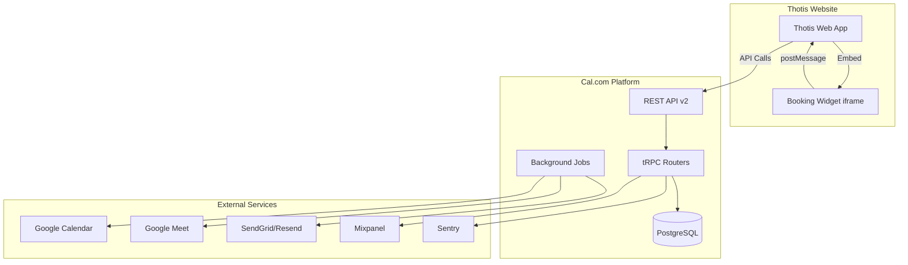
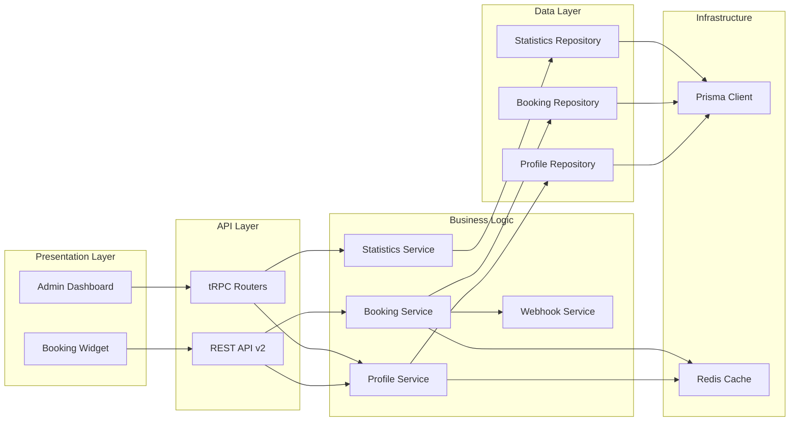
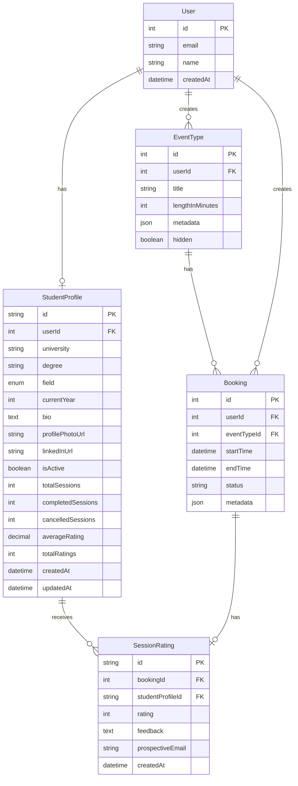

# Design Document: Thotis Student Mentoring Platform

## Overview

The Thotis Student Mentoring Platform is built on a self-hosted Cal.com instance (AGPLv3 license) with custom extensions to support student mentoring use cases. The architecture follows Cal.com's existing patterns while adding new domain models, API endpoints, and UI customizations to create a seamless, branded experience for connecting university student mentors with prospective students.

### Key Design Principles

1. **Minimal Modification**: Leverage Cal.com's existing booking, calendar sync, and notification infrastructure
2. **Extension Over Replacement**: Add new models and endpoints rather than modifying core Cal.com code
3. **API-First Integration**: Provide REST APIs for seamless Thotis website integration
4. **Branding Isolation**: Use theming system for Thotis branding without touching core UI components
5. **License Compliance**: Publish all modifications under AGPLv3

### Technology Stack

- **Backend**: Next.js 13+ (App Router), TypeScript, tRPC
- **Database**: PostgreSQL with Prisma ORM
- **Calendar Integration**: Google Calendar API (OAuth2)
- **Video**: Google Meet
- **Email**: SendGrid or Resend with custom templates
- **Analytics**: Mixpanel for event tracking
- **Monitoring**: Sentry for error tracking
- **Deployment**: Coolify (existing infrastructure)

## Architecture

### System Context



### Component Architecture

The system extends Cal.com's existing architecture with new components:



## Components and Interfaces

### 1. Database Extensions

#### StudentProfile Model

Extends Cal.com's User model with student-specific information:

```prisma
model StudentProfile {
  id                String   @id @default(cuid())
  userId            Int      @unique
  user              User     @relation(fields: [userId], references: [id], onDelete: Cascade)
  
  // Academic Information
  university        String
  degree            String
  field             AcademicField
  currentYear       Int
  
  // Profile Information
  bio               String   @db.Text
  profilePhotoUrl   String?
  linkedInUrl       String?
  
  // Status
  isActive          Boolean  @default(true)
  
  // Statistics
  totalSessions     Int      @default(0)
  completedSessions Int      @default(0)
  cancelledSessions Int      @default(0)
  averageRating     Decimal? @db.Decimal(3, 2)
  totalRatings      Int      @default(0)
  
  // Timestamps
  createdAt         DateTime @default(now())
  updatedAt         DateTime @updatedAt
  
  // Relations
  ratings           SessionRating[]
  
  @@index([field, isActive])
  @@index([userId])
}

enum AcademicField {
  LAW
  MEDICINE
  ENGINEERING
  BUSINESS
  COMPUTER_SCIENCE
  PSYCHOLOGY
  EDUCATION
  ARTS
  SCIENCES
  OTHER
}
```

#### SessionRating Model

Stores ratings and feedback for completed sessions:

```prisma
model SessionRating {
  id                  String         @id @default(cuid())
  bookingId           Int            @unique
  booking             Booking        @relation(fields: [bookingId], references: [id], onDelete: Cascade)
  
  studentProfileId    String
  studentProfile      StudentProfile @relation(fields: [studentProfileId], references: [id], onDelete: Cascade)
  
  rating              Int            // 1-5 stars
  feedback            String?        @db.Text
  prospectiveEmail    String         // Email of the prospective student who rated
  
  createdAt           DateTime       @default(now())
  
  @@index([studentProfileId])
  @@index([bookingId])
}
```

#### EventType Customization

Extend existing EventType model with metadata for 15-minute sessions:

```typescript
// Add to EventType.metadata JSON field
interface ThotisEventTypeMetadata {
  isThotisSession: boolean;
  lockedDuration: true; // Prevents duration changes
  studentProfileId: string;
}
```

### 2. Service Layer

#### ProfileService

Handles student mentor profile operations:

```typescript
interface ProfileService {
  // Profile Management
  createProfile(userId: number, data: CreateProfileInput): Promise<StudentProfile>;
  updateProfile(profileId: string, data: UpdateProfileInput): Promise<StudentProfile>;
  getProfile(profileId: string): Promise<StudentProfile | null>;
  getProfileByUserId(userId: number): Promise<StudentProfile | null>;
  
  // Discovery
  getProfilesByField(field: AcademicField, options: PaginationOptions): Promise<ProfileListResult>;
  searchProfiles(query: SearchProfileInput): Promise<ProfileListResult>;
  
  // Status Management
  activateProfile(profileId: string): Promise<void>;
  deactivateProfile(profileId: string): Promise<void>;
}

interface CreateProfileInput {
  university: string;
  degree: string;
  field: AcademicField;
  currentYear: number;
  bio: string;
  profilePhotoUrl?: string;
  linkedInUrl?: string;
}

interface UpdateProfileInput {
  university?: string;
  degree?: string;
  field?: AcademicField;
  currentYear?: number;
  bio?: string;
  profilePhotoUrl?: string;
  linkedInUrl?: string;
  isActive?: boolean;
}

interface SearchProfileInput {
  field?: AcademicField;
  university?: string;
  hasAvailability?: boolean;
  minRating?: number;
}

interface ProfileListResult {
  profiles: StudentProfileSummary[];
  total: number;
  page: number;
  pageSize: number;
}

interface StudentProfileSummary {
  id: string;
  userId: number;
  name: string;
  university: string;
  degree: string;
  field: AcademicField;
  currentYear: number;
  bioExcerpt: string; // First 150 characters
  profilePhotoUrl: string | null;
  averageRating: number | null;
  totalRatings: number;
  hasAvailability: boolean;
}
```

#### BookingService

Extends Cal.com's booking service with Thotis-specific logic:

```typescript
interface ThotisBookingService {
  // Booking Creation
  createStudentSession(input: CreateSessionInput): Promise<BookingResult>;
  
  // Availability
  getStudentAvailability(
    studentProfileId: string,
    dateRange: DateRange
  ): Promise<AvailabilitySlot[]>;
  
  // Session Management
  cancelSession(bookingId: number, reason: string, cancelledBy: 'mentor' | 'student'): Promise<void>;
  rescheduleSession(bookingId: number, newDateTime: Date): Promise<BookingResult>;
  
  // Completion
  markSessionComplete(bookingId: number): Promise<void>;
}

interface CreateSessionInput {
  studentProfileId: string;
  dateTime: Date;
  prospectiveStudent: {
    name: string;
    email: string;
    question?: string;
  };
}

interface BookingResult {
  bookingId: number;
  googleMeetLink: string;
  calendarEventId: string;
  confirmationSent: boolean;
}

interface DateRange {
  start: Date;
  end: Date;
}

interface AvailabilitySlot {
  start: Date;
  end: Date;
  available: boolean;
}
```

#### StatisticsService

Calculates and caches student mentor statistics:

```typescript
interface StatisticsService {
  // Individual Statistics
  getStudentStats(studentProfileId: string): Promise<StudentStatistics>;
  updateSessionCount(studentProfileId: string, type: 'scheduled' | 'completed' | 'cancelled'): Promise<void>;
  
  // Rating Management
  addRating(bookingId: number, rating: number, feedback?: string): Promise<void>;
  recalculateAverageRating(studentProfileId: string): Promise<void>;
  
  // Platform Statistics
  getPlatformStats(): Promise<PlatformStatistics>;
}

interface StudentStatistics {
  totalSessions: number;
  completedSessions: number;
  cancelledSessions: number;
  completionRate: number; // Percentage
  cancellationRate: number; // Percentage
  averageRating: number | null;
  totalRatings: number;
}

interface PlatformStatistics {
  totalStudentMentors: number;
  activeStudentMentors: number;
  totalSessions: number;
  completedSessions: number;
  averageCompletionRate: number;
  averageCancellationRate: number;
  sessionsByField: Record<AcademicField, number>;
}
```

#### WebhookService

Sends webhook notifications for booking events:

```typescript
interface WebhookService {
  // Webhook Delivery
  sendBookingCreated(booking: Booking): Promise<void>;
  sendBookingCancelled(booking: Booking, reason: string): Promise<void>;
  sendBookingCompleted(booking: Booking): Promise<void>;
  sendBookingRescheduled(booking: Booking, oldDateTime: Date): Promise<void>;
  
  // Retry Logic
  retryFailedWebhook(webhookId: string): Promise<void>;
}

interface WebhookPayload {
  event: 'booking.created' | 'booking.cancelled' | 'booking.completed' | 'booking.rescheduled';
  timestamp: string;
  data: {
    bookingId: number;
    studentProfileId: string;
    prospectiveStudentEmail: string;
    dateTime: string;
    metadata?: Record<string, unknown>;
  };
  signature: string; // HMAC-SHA256
}
```

### 3. API Endpoints

#### REST API v2 Routes

```typescript
// Student Profile Endpoints
GET    /api/v2/students/by-field/:field
GET    /api/v2/students/:id
GET    /api/v2/students/:id/availability
POST   /api/v2/students/:id/profile
PUT    /api/v2/students/:id/profile
PATCH  /api/v2/students/:id/status

// Booking Endpoints
POST   /api/v2/bookings
GET    /api/v2/bookings/:id
DELETE /api/v2/bookings/:id
PATCH  /api/v2/bookings/:id/reschedule

// Rating Endpoints
POST   /api/v2/bookings/:id/rating
GET    /api/v2/students/:id/ratings

// Statistics Endpoints
GET    /api/v2/students/:id/stats
GET    /api/v2/platform/stats
```

#### API Request/Response Examples

**GET /api/v2/students/by-field/:field**

Query Parameters:
- `page` (optional): Page number (default: 1)
- `pageSize` (optional): Results per page (default: 20)
- `university` (optional): Filter by university
- `minRating` (optional): Minimum average rating
- `hasAvailability` (optional): Only show mentors with available slots

Response:
```json
{
  "status": "success",
  "data": {
    "profiles": [
      {
        "id": "clx123abc",
        "userId": 42,
        "name": "Marie Dubois",
        "university": "Université Paris 1 Panthéon-Sorbonne",
        "degree": "Master en Droit des Affaires",
        "field": "LAW",
        "currentYear": 2,
        "bioExcerpt": "Passionnée par le droit des affaires et le droit européen. J'ai effectué un stage chez...",
        "profilePhotoUrl": "https://cdn.thotis.fr/profiles/marie-dubois.jpg",
        "averageRating": 4.8,
        "totalRatings": 15,
        "hasAvailability": true
      }
    ],
    "total": 45,
    "page": 1,
    "pageSize": 20
  }
}
```

**POST /api/v2/bookings**

Request:
```json
{
  "studentProfileId": "clx123abc",
  "dateTime": "2024-02-15T14:00:00Z",
  "prospectiveStudent": {
    "name": "Lucas Martin",
    "email": "lucas.martin@lycee.fr",
    "question": "Questions sur les débouchés en droit des affaires"
  }
}
```

Response:
```json
{
  "status": "success",
  "data": {
    "bookingId": 1234,
    "googleMeetLink": "https://meet.google.com/abc-defg-hij",
    "calendarEventId": "evt_abc123",
    "confirmationSent": true,
    "booking": {
      "id": 1234,
      "startTime": "2024-02-15T14:00:00Z",
      "endTime": "2024-02-15T14:15:00Z",
      "status": "ACCEPTED"
    }
  }
}
```

### 4. UI Components

#### Booking Widget

Embeddable iframe for Thotis website integration:

```typescript
interface BookingWidgetProps {
  studentProfileId: string;
  theme: 'light' | 'dark';
  primaryColor?: string;
  locale?: 'fr' | 'en';
  prefillData?: {
    name?: string;
    email?: string;
  };
  onBookingComplete?: (bookingId: number) => void;
  onError?: (error: Error) => void;
}

// Widget communicates with parent via postMessage
interface WidgetMessage {
  type: 'booking.complete' | 'booking.error' | 'widget.ready' | 'widget.resize';
  payload: unknown;
}
```

#### Student Profile Card

Reusable component for displaying student mentor profiles:

```typescript
interface ProfileCardProps {
  profile: StudentProfileSummary;
  showBookButton?: boolean;
  onBookClick?: (profileId: string) => void;
}
```

#### Admin Dashboard

Dashboard for monitoring platform health and student mentor performance:

```typescript
interface DashboardProps {
  dateRange: DateRange;
  filters: {
    field?: AcademicField;
    university?: string;
  };
}

// Dashboard Sections:
// 1. Platform Overview (total mentors, sessions, completion rate)
// 2. Student Mentor List (sortable by rating, sessions, cancellation rate)
// 3. Session Trends (chart showing sessions over time)
// 4. Field Distribution (pie chart of sessions by field)
// 5. System Health (API response times, error rates, uptime)
```

## Data Models

### Entity Relationship Diagram



### Data Validation Rules

1. **StudentProfile**:
   - `university`: Non-empty string, max 200 characters
   - `degree`: Non-empty string, max 200 characters
   - `field`: Must be valid AcademicField enum value
   - `currentYear`: Integer between 1 and 10
   - `bio`: Non-empty string, min 50 characters, max 1000 characters
   - `profilePhotoUrl`: Valid HTTPS URL or null
   - `linkedInUrl`: Valid LinkedIn URL format or null
   - `averageRating`: Decimal between 1.00 and 5.00 or null

2. **SessionRating**:
   - `rating`: Integer between 1 and 5
   - `feedback`: Optional string, max 500 characters
   - `prospectiveEmail`: Valid email format

3. **Booking Metadata**:
   - `prospectiveStudentName`: Non-empty string
   - `prospectiveStudentEmail`: Valid email format
   - `question`: Optional string, max 500 characters

### Caching Strategy

Use Redis for caching frequently accessed data:

```typescript
// Cache Keys
const CACHE_KEYS = {
  PROFILE_BY_ID: (id: string) => `profile:${id}`,
  PROFILES_BY_FIELD: (field: string, page: number) => `profiles:field:${field}:page:${page}`,
  STUDENT_STATS: (id: string) => `stats:student:${id}`,
  PLATFORM_STATS: 'stats:platform',
  AVAILABILITY: (profileId: string, date: string) => `availability:${profileId}:${date}`,
};

// Cache TTLs
const CACHE_TTL = {
  PROFILE: 300, // 5 minutes
  PROFILES_LIST: 60, // 1 minute
  STATS: 600, // 10 minutes
  AVAILABILITY: 120, // 2 minutes
};
```

## Correctness Properties

*A property is a characteristic or behavior that should hold true across all valid executions of a system—essentially, a formal statement about what the system should do. Properties serve as the bridge between human-readable specifications and machine-verifiable correctness guarantees.*

### Property Reflection

After analyzing all 100 acceptance criteria, I identified redundancies and combined related properties:

- Profile data persistence (1.1) and profile field validation (1.2) can be combined into a single comprehensive property
- Session duration enforcement (3.1, 3.2, 3.3, 3.4) are all testing the same invariant and can be combined
- Filtering properties (4.1, 4.5, 18.1, 18.2) test similar logic and can be consolidated
- Statistics counter updates (7.2, 13.3) test the same pattern and can be combined
- Cancellation time validation (13.1, 13.5) are redundant
- Rating calculation (7.4, 19.3) test the same logic

### Core Properties

Property 1: Profile Data Round Trip
*For any* valid profile data (university, degree, field, year, bio, photo URL, LinkedIn URL), creating a profile then retrieving it should return equivalent data with all required fields present
**Validates: Requirements 1.1, 1.2**

Property 2: Profile Photo Normalization
*For any* uploaded image, the system should resize it to exactly 400x400 pixels regardless of input dimensions
**Validates: Requirements 1.3**

Property 3: Profile Status Toggle
*For any* student profile, toggling the status from active to inactive and back to active should result in the profile being active
**Validates: Requirements 1.4**

Property 4: Incomplete Profile Exclusion
*For any* search query, all returned profiles should have all required fields (university, degree, field, year, bio) populated
**Validates: Requirements 1.5**

Property 5: Availability Timezone Persistence
*For any* availability schedule with timezone information, storing then retrieving the schedule should preserve the exact timezone
**Validates: Requirements 2.2**

Property 6: Calendar Conflict Exclusion
*For any* student mentor with calendar conflicts, the available time slots should exclude all conflicting times
**Validates: Requirements 2.3, 11.4**

Property 7: Double Booking Prevention
*For any* time slot that already has a booking, attempting to create another booking at the same time should be rejected
**Validates: Requirements 2.5**

Property 8: Session Duration Invariant
*For any* Thotis event type or booking, the duration should always be exactly 15 minutes
**Validates: Requirements 3.1, 3.2, 3.3, 3.4**

Property 9: Field-Based Filtering
*For any* academic field filter, all returned profiles should match that field and have active status
**Validates: Requirements 4.1, 4.5, 18.1**

Property 10: Profile Summary Format
*For any* profile in search results, the bio excerpt should be exactly the first 150 characters of the full bio
**Validates: Requirements 4.2**

Property 11: Availability Sorting
*For any* list of student mentors, those with more available slots should appear before those with fewer available slots
**Validates: Requirements 4.4**

Property 12: Availability Time Window
*For any* availability query, all returned time slots should be within the next 30 days from the query date
**Validates: Requirements 5.1**

Property 13: Booking Data Completeness
*For any* booking, the prospective student name and email should be stored, and the question field should be stored if provided
**Validates: Requirements 5.2**

Property 14: Minimum Booking Notice
*For any* booking attempt, if the requested time is less than 2 hours in the future, the booking should be rejected
**Validates: Requirements 5.5, 13.1, 13.5**

Property 15: Email Branding Consistency
*For any* system-generated email, the content should include Thotis logo reference, use colors #FF6B35 and #004E89, and specify Montserrat or Inter fonts
**Validates: Requirements 6.1**

Property 16: Booking Confirmation Email Content
*For any* confirmed booking, the confirmation emails should include session date, time, student mentor name, prospective student name, and Google Meet link
**Validates: Requirements 6.2**

Property 17: Rescheduling Email Updates
*For any* rescheduled booking, the notification emails should include both the old and new date/time
**Validates: Requirements 6.5**

Property 18: Statistics Calculation Accuracy
*For any* student mentor, the completion rate should equal (completedSessions / totalSessions) * 100, and cancellation rate should equal (cancelledSessions / totalSessions) * 100
**Validates: Requirements 7.1**

Property 19: Session Counter Updates
*For any* session that is completed or cancelled, the corresponding counter (completedSessions or cancelledSessions) should increment by exactly 1
**Validates: Requirements 7.2, 13.3**

Property 20: Rating Storage and Validation
*For any* submitted rating, the rating value should be between 1 and 5 inclusive, and feedback (if provided) should be stored
**Validates: Requirements 7.3, 19.2**

Property 21: Average Rating Calculation
*For any* student mentor with ratings, the average rating should equal the sum of all ratings divided by the count of ratings, rounded to one decimal place
**Validates: Requirements 7.4, 19.3**

Property 22: Profile Statistics Display
*For any* student mentor profile query, the response should include totalSessions, completedSessions, cancelledSessions, averageRating, and totalRatings
**Validates: Requirements 7.5, 19.5**

Property 23: API Authentication Enforcement
*For any* API endpoint request without a valid JWT token, the system should return HTTP 401 Unauthorized
**Validates: Requirements 8.5**

Property 24: API Response Format Consistency
*For any* successful API request, the response should have a "status" field set to "success" and a "data" field containing the payload
**Validates: Requirements 8.1, 8.2, 8.3, 8.4**

Property 25: Widget PostMessage Communication
*For any* booking completion in the widget, a postMessage event with type "booking.complete" should be sent to the parent window
**Validates: Requirements 9.3**

Property 26: URL Parameter Pre-filling
*For any* widget loaded with URL parameters "name" and "email", the booking form should be pre-filled with those values
**Validates: Requirements 9.5**

Property 27: Webhook Payload Signature
*For any* webhook payload, the signature should be a valid HMAC-SHA256 hash of the payload using the configured secret key
**Validates: Requirements 10.5**

Property 28: Webhook Event Types
*For any* booking lifecycle event (created, cancelled, completed, rescheduled), a corresponding webhook should be sent with the correct event type
**Validates: Requirements 10.1, 10.2, 10.3**

Property 29: Webhook Retry Exponential Backoff
*For any* failed webhook delivery, retries should occur at 1 second, 2 seconds, and 4 seconds intervals (up to 3 retries total)
**Validates: Requirements 10.4**

Property 30: Google Meet Link Uniqueness
*For any* two different bookings, they should have different Google Meet links
**Validates: Requirements 12.1**

Property 31: Calendar Event Meet Link Inclusion
*For any* booking, the calendar event description should contain the Google Meet link
**Validates: Requirements 12.4**

Property 32: Rescheduling Meet Link Regeneration
*For any* rescheduled booking, the new Google Meet link should be different from the original link
**Validates: Requirements 12.5**

Property 33: Cancellation Notification Side Effects
*For any* cancelled booking, both the student mentor and prospective student should receive cancellation notifications
**Validates: Requirements 13.2**

Property 34: Reschedule Availability Display
*For any* reschedule request, the system should display available alternative time slots that don't conflict with existing bookings
**Validates: Requirements 13.4**

Property 35: Error Logging Context Completeness
*For any* error logged to Sentry, the log entry should include user ID (if available), request details, and stack trace
**Validates: Requirements 16.1**

Property 36: User-Friendly Error Messages
*For any* booking failure, the error message shown to the user should not contain technical details like stack traces or database errors
**Validates: Requirements 16.2**

Property 37: HTTP Status Code Correctness
*For any* API request with invalid input, the response should have HTTP status 400; for server errors, status should be 500
**Validates: Requirements 16.3**

Property 38: University Filter Accuracy
*For any* university filter, all returned profiles should be from that exact university
**Validates: Requirements 18.2**

Property 39: Availability Filter Accuracy
*For any* availability filter set to true, all returned profiles should have at least one available slot in the next 7 days
**Validates: Requirements 18.3**

Property 40: Multiple Filter AND Logic
*For any* query with multiple filters (field, university, availability), results should match ALL filter criteria simultaneously
**Validates: Requirements 18.4**

Property 41: Result Count Accuracy
*For any* filtered query, the returned count should equal the actual number of results in the response
**Validates: Requirements 18.5**

Property 42: Low Rating Flagging
*For any* session rating below 3 stars, the session should be flagged for administrator review
**Validates: Requirements 19.4**

Property 43: Platform Statistics Aggregation
*For any* platform statistics query, totalSessions should equal the sum of all student mentors' totalSessions
**Validates: Requirements 20.1**

Property 44: Session Trends Time Grouping
*For any* time period (daily, weekly, monthly), session trends should correctly group sessions by that time period
**Validates: Requirements 20.2**

Property 45: Mentor List Statistics Accuracy
*For any* mentor in the admin list, their displayed completion rate and cancellation rate should match their actual calculated rates
**Validates: Requirements 20.3**

Property 46: CSV Export Format Validity
*For any* exported report, the CSV should have a header row and all data rows should have the same number of columns as the header
**Validates: Requirements 20.5**

## Error Handling

### Error Types and Handling Strategy

Following Cal.com conventions, we use different error types based on context:

1. **Service Layer Errors** (use `ErrorWithCode`):
   ```typescript
   import { ErrorWithCode } from "@calcom/lib/ErrorWithCode";
   
   // Profile validation error
   throw new ErrorWithCode({
     code: "INVALID_PROFILE_DATA",
     message: `Profile bio must be between 50 and 1000 characters, got ${bio.length}`,
   });
   
   // Booking conflict error
   throw new ErrorWithCode({
     code: "BOOKING_CONFLICT",
     message: `Time slot ${dateTime} is already booked for student mentor ${profileId}`,
   });
   ```

2. **tRPC Router Errors** (use `TRPCError`):
   ```typescript
   import { TRPCError } from "@trpc/server";
   
   // Authentication error
   throw new TRPCError({
     code: "UNAUTHORIZED",
     message: "Valid JWT token required for this endpoint",
   });
   
   // Not found error
   throw new TRPCError({
     code: "NOT_FOUND",
     message: `Student profile ${profileId} not found`,
   });
   ```

3. **API v2 Errors** (HTTP status codes with error responses):
   ```typescript
   return res.status(400).json({
     status: "error",
     error: {
       code: "INVALID_INPUT",
       message: "Session duration must be exactly 15 minutes",
       details: { providedDuration, requiredDuration: 15 }
     }
   });
   ```

### Error Codes

```typescript
enum ThotisErrorCode {
  // Profile Errors
  INVALID_PROFILE_DATA = "INVALID_PROFILE_DATA",
  PROFILE_NOT_FOUND = "PROFILE_NOT_FOUND",
  PROFILE_INCOMPLETE = "PROFILE_INCOMPLETE",
  PROFILE_INACTIVE = "PROFILE_INACTIVE",
  
  // Booking Errors
  BOOKING_CONFLICT = "BOOKING_CONFLICT",
  INVALID_DURATION = "INVALID_DURATION",
  MINIMUM_NOTICE_REQUIRED = "MINIMUM_NOTICE_REQUIRED",
  BOOKING_NOT_FOUND = "BOOKING_NOT_FOUND",
  CANCELLATION_TOO_LATE = "CANCELLATION_TOO_LATE",
  
  // Rating Errors
  INVALID_RATING = "INVALID_RATING",
  RATING_ALREADY_EXISTS = "RATING_ALREADY_EXISTS",
  SESSION_NOT_COMPLETED = "SESSION_NOT_COMPLETED",
  
  // Authentication Errors
  INVALID_TOKEN = "INVALID_TOKEN",
  TOKEN_EXPIRED = "TOKEN_EXPIRED",
  INSUFFICIENT_PERMISSIONS = "INSUFFICIENT_PERMISSIONS",
  
  // Integration Errors
  GOOGLE_CALENDAR_ERROR = "GOOGLE_CALENDAR_ERROR",
  GOOGLE_MEET_ERROR = "GOOGLE_MEET_ERROR",
  EMAIL_DELIVERY_ERROR = "EMAIL_DELIVERY_ERROR",
  WEBHOOK_DELIVERY_ERROR = "WEBHOOK_DELIVERY_ERROR",
}
```

### Error Monitoring

All errors are logged to Sentry with appropriate context:

```typescript
import * as Sentry from "@sentry/nextjs";

function logError(error: Error, context: Record<string, unknown>) {
  Sentry.captureException(error, {
    tags: {
      feature: "thotis-mentoring",
      errorCode: (error as ErrorWithCode).code,
    },
    extra: context,
  });
}
```

## Testing Strategy

### Dual Testing Approach

The testing strategy combines unit tests for specific examples and edge cases with property-based tests for universal correctness properties. Both approaches are complementary and necessary for comprehensive coverage.

### Unit Testing

Unit tests focus on:
- Specific examples that demonstrate correct behavior
- Edge cases (empty inputs, boundary values, null handling)
- Error conditions and validation
- Integration points between components

**Example Unit Tests**:
```typescript
describe("ProfileService", () => {
  it("should reject profile creation with bio shorter than 50 characters", async () => {
    const shortBio = "Too short";
    await expect(
      profileService.createProfile(userId, { ...validData, bio: shortBio })
    ).rejects.toThrow("Profile bio must be between 50 and 1000 characters");
  });
  
  it("should handle null profile photo URL", async () => {
    const profile = await profileService.createProfile(userId, {
      ...validData,
      profilePhotoUrl: null
    });
    expect(profile.profilePhotoUrl).toBeNull();
  });
});
```

### Property-Based Testing

Property-based tests verify universal properties across randomly generated inputs. We use **fast-check** for TypeScript property-based testing.

**Configuration**:
- Minimum 100 iterations per property test
- Each test references its design document property
- Tag format: `Feature: thotis-student-mentoring, Property {number}: {property_text}`

**Example Property Tests**:
```typescript
import * as fc from "fast-check";

describe("Property Tests: Profile Management", () => {
  it("Property 1: Profile Data Round Trip", async () => {
    // Feature: thotis-student-mentoring, Property 1: Profile Data Round Trip
    await fc.assert(
      fc.asyncProperty(
        fc.record({
          university: fc.string({ minLength: 1, maxLength: 200 }),
          degree: fc.string({ minLength: 1, maxLength: 200 }),
          field: fc.constantFrom(...Object.values(AcademicField)),
          currentYear: fc.integer({ min: 1, max: 10 }),
          bio: fc.string({ minLength: 50, maxLength: 1000 }),
          profilePhotoUrl: fc.option(fc.webUrl({ validSchemes: ["https"] })),
          linkedInUrl: fc.option(fc.webUrl({ validSchemes: ["https"] })),
        }),
        async (profileData) => {
          const created = await profileService.createProfile(userId, profileData);
          const retrieved = await profileService.getProfile(created.id);
          
          expect(retrieved).not.toBeNull();
          expect(retrieved!.university).toBe(profileData.university);
          expect(retrieved!.degree).toBe(profileData.degree);
          expect(retrieved!.field).toBe(profileData.field);
          expect(retrieved!.currentYear).toBe(profileData.currentYear);
          expect(retrieved!.bio).toBe(profileData.bio);
        }
      ),
      { numRuns: 100 }
    );
  });
  
  it("Property 8: Session Duration Invariant", async () => {
    // Feature: thotis-student-mentoring, Property 8: Session Duration Invariant
    await fc.assert(
      fc.asyncProperty(
        fc.string(), // studentProfileId
        fc.date(), // dateTime
        fc.record({
          name: fc.string({ minLength: 1 }),
          email: fc.emailAddress(),
          question: fc.option(fc.string()),
        }),
        async (profileId, dateTime, prospectiveStudent) => {
          const booking = await bookingService.createStudentSession({
            studentProfileId: profileId,
            dateTime,
            prospectiveStudent,
          });
          
          const retrieved = await bookingRepo.getBooking(booking.bookingId);
          const duration = (retrieved.endTime.getTime() - retrieved.startTime.getTime()) / 60000;
          
          expect(duration).toBe(15); // Exactly 15 minutes
        }
      ),
      { numRuns: 100 }
    );
  });
});
```

### Integration Testing

Integration tests verify:
- API endpoint behavior
- Database transactions
- External service integrations (Google Calendar, Google Meet, email)
- Webhook delivery

### Test Organization

```
packages/features/thotis/
├── services/
│   ├── ProfileService.ts
│   ├── ProfileService.test.ts          # Unit tests
│   ├── ProfileService.property.test.ts # Property tests
│   ├── BookingService.ts
│   ├── BookingService.test.ts
│   └── BookingService.property.test.ts
├── repositories/
│   ├── ProfileRepository.ts
│   └── ProfileRepository.test.ts
└── api/
    ├── students.ts
    └── students.integration.test.ts
```

### Test Data Generators

Create reusable generators for property tests:

```typescript
// test/generators.ts
import * as fc from "fast-check";

export const studentProfileArbitrary = fc.record({
  university: fc.string({ minLength: 1, maxLength: 200 }),
  degree: fc.string({ minLength: 1, maxLength: 200 }),
  field: fc.constantFrom(...Object.values(AcademicField)),
  currentYear: fc.integer({ min: 1, max: 10 }),
  bio: fc.string({ minLength: 50, maxLength: 1000 }),
  profilePhotoUrl: fc.option(fc.webUrl({ validSchemes: ["https"] })),
  linkedInUrl: fc.option(fc.webUrl({ validSchemes: ["https"] })),
});

export const bookingArbitrary = fc.record({
  studentProfileId: fc.uuid(),
  dateTime: fc.date({ min: new Date(Date.now() + 2 * 60 * 60 * 1000) }), // At least 2 hours in future
  prospectiveStudent: fc.record({
    name: fc.string({ minLength: 1, maxLength: 100 }),
    email: fc.emailAddress(),
    question: fc.option(fc.string({ maxLength: 500 })),
  }),
});

export const ratingArbitrary = fc.record({
  rating: fc.integer({ min: 1, max: 5 }),
  feedback: fc.option(fc.string({ maxLength: 500 })),
  prospectiveEmail: fc.emailAddress(),
});
```

### CI/CD Testing

```bash
# Run all tests
yarn test

# Run only unit tests
yarn test:unit

# Run only property tests
yarn test:property

# Run with coverage
yarn test:coverage

# Type check
yarn type-check:ci --force
```

## Implementation Notes

### Cal.com Integration Points

1. **Extend Existing Models**: Add StudentProfile and SessionRating to `packages/prisma/schema.prisma`
2. **Create Feature Package**: `packages/features/thotis/` for all Thotis-specific code
3. **Add API Routes**: `apps/api/v2/students/` for new REST endpoints
4. **Create tRPC Routers**: `packages/trpc/server/routers/thotis.ts` for internal APIs
5. **Customize Email Templates**: `packages/emails/templates/thotis/` for branded emails
6. **Add Translations**: `apps/web/public/static/locales/en/common.json` and `fr/common.json`

### Database Migration Strategy

1. Create migration for StudentProfile model
2. Create migration for SessionRating model
3. Add indexes for performance
4. Seed initial AcademicField enum values

### Deployment Considerations

1. **Environment Variables**:
   ```env
   THOTIS_JWT_SECRET=<secret>
   THOTIS_WEBHOOK_SECRET=<secret>
   THOTIS_PRIMARY_COLOR=#FF6B35
   THOTIS_SECONDARY_COLOR=#004E89
   GOOGLE_MEET_ENABLED=true
   MIXPANEL_TOKEN=<token>
   SENTRY_DSN=<dsn>
   ```

2. **Redis Configuration**: Ensure Redis is available for caching
3. **CDN Setup**: Configure CDN for profile photos
4. **Monitoring**: Set up Sentry project and Mixpanel tracking

### Security Considerations

1. **JWT Token Validation**: Verify tokens on all API endpoints
2. **Rate Limiting**: Implement rate limiting on public endpoints
3. **Input Sanitization**: Sanitize all user inputs to prevent XSS
4. **SQL Injection Prevention**: Use Prisma parameterized queries (already handled)
5. **CORS Configuration**: Restrict CORS to Thotis domain only
6. **Webhook Signature Verification**: Always verify HMAC signatures

### Performance Optimization

1. **Database Indexes**: Add indexes on frequently queried fields (field, isActive, userId)
2. **Query Optimization**: Use `select` instead of `include` in Prisma queries
3. **Caching Strategy**: Cache profile lists, availability, and statistics
4. **Pagination**: Implement cursor-based pagination for large result sets
5. **Background Jobs**: Use job queue for webhook delivery and email sending

### Monitoring and Observability

1. **Metrics to Track**:
   - API response times (p50, p95, p99)
   - Error rates by endpoint
   - Booking success/failure rates
   - Webhook delivery success rates
   - Cache hit/miss rates

2. **Alerts**:
   - API error rate > 5%
   - Booking failure rate > 10%
   - Webhook delivery failure rate > 20%
   - Database connection failures

3. **Logging**:
   - All API requests (with sanitized data)
   - All booking lifecycle events
   - All webhook deliveries
   - All errors with full context
